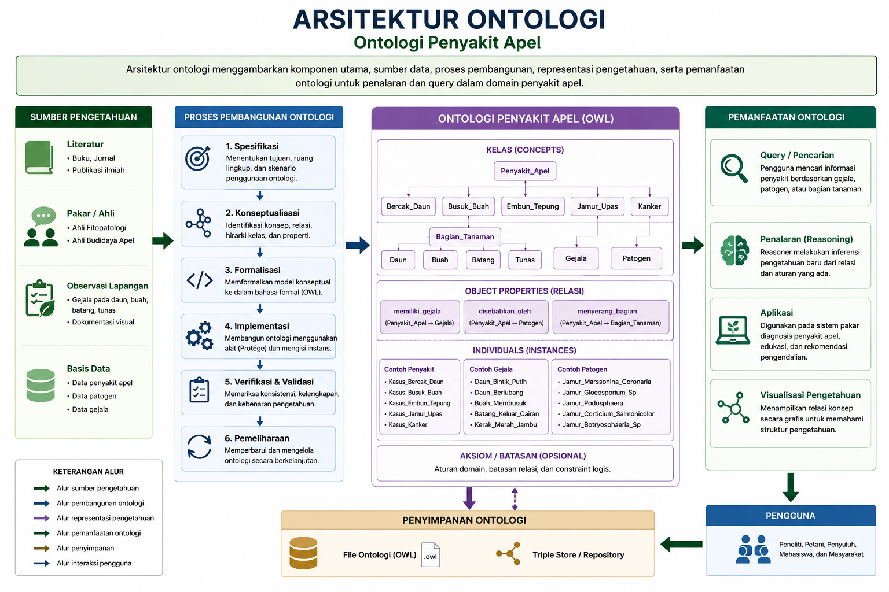
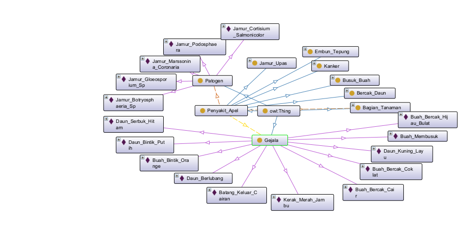
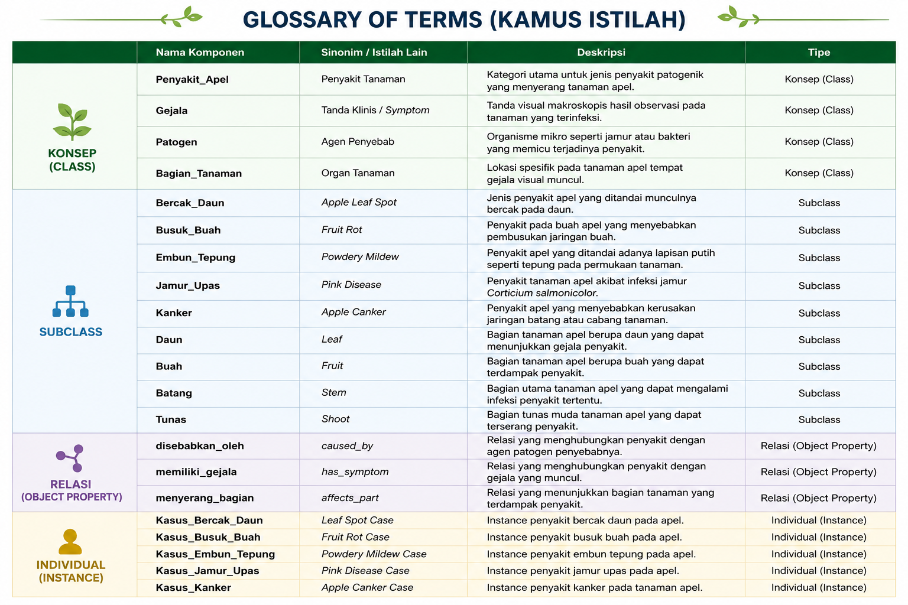
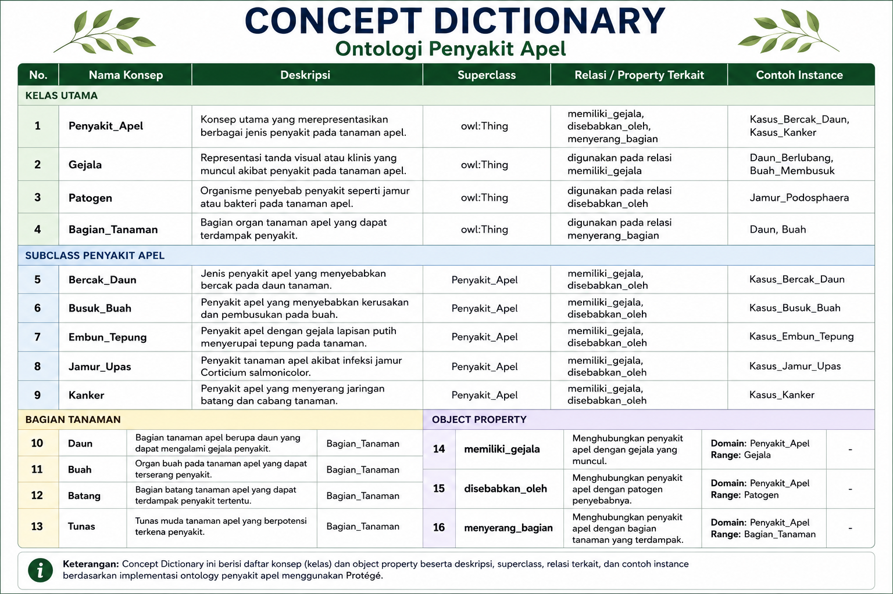
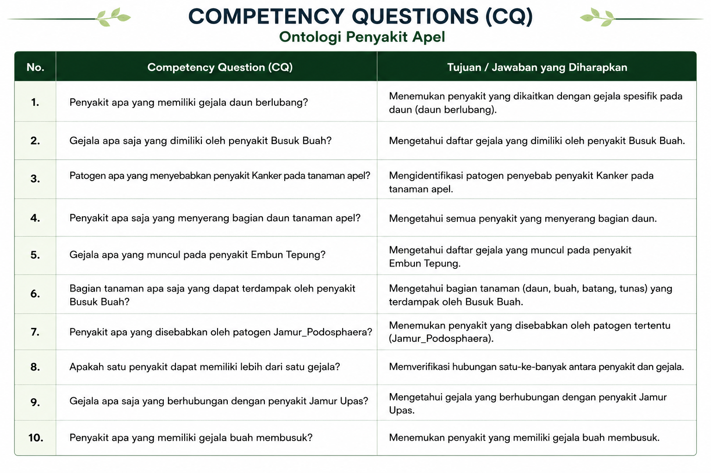
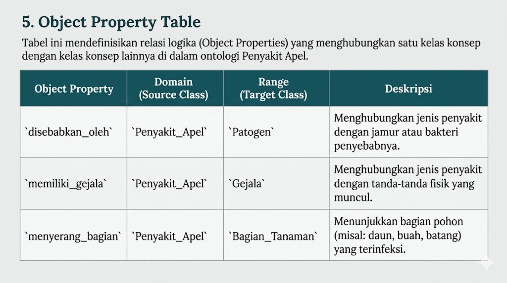

# 🍎 Sistem Pakar Diagnosis Penyakit Tanaman Apel

Repository ini berisi proyek **Sistem Berbasis Pengetahuan (Knowledge-Based System)** untuk mendiagnosis penyakit spesifik pada tanaman apel. Sistem ini dikembangkan menggunakan kerangka kerja **Methontology** dengan tools **Protégé** dan reasoner **HermiT/Pellet**.

Proyek ini disusun sebagai bentuk penyelesaian Ujian Akhir Semester (UAS) mata kuliah Pengembangan Sistem Berbasis Pengetahuan.

---

## 📖 Deskripsi Kasus

Identifikasi penyakit pada tanaman hortikultura, khususnya apel, sering kali menjadi tantangan bagi petani karena kemiripan gejala visual. Diagnosis yang terlambat atau salah dapat berujung pada kerugian ekonomi dan penurunan produktivitas. Sistem pakar ini dirancang untuk membantu petani dalam mengidentifikasi penyakit berdasarkan gejala yang diamati.

### 🦠 Penyakit yang Diidentifikasi:
1. **Embun Tepung** (*Podosphaera Leucotricha*)
2. **Bercak Daun** (*Marssonina Coronaria*)
3. **Jamur Upas** (*Cortisium Salmonicolor*)
4. **Kanker** (*Botryosphaeria Sp.*)
5. **Busuk Buah** (*Gloeosporium Sp.*)

---

## 🎯 Solusi Penyelesaian

Kami membangun sebuah **ontologi terstruktur** yang merepresentasikan:
- **Kelas (Classes)** - Konsep utama sistem pakar
- **Relasi Antar Konsep (Object Properties)** - Hubungan antar elemen
- **Data Spesifik (Individuals)** - Instansi konkret dari penyakit dan gejala

Sistem ini menerima input berupa gejala yang diamati dan menghasilkan diagnosis penyakit melalui proses reasoning menggunakan DL Query.

### 📊 Arsitektur Ontology



*Gambar: Struktur keseluruhan arsitektur ontologi sistem pakar apel*

---

## 🛠️ Lingkungan Kerja (Tools)

| Komponen | Deskripsi |
|----------|-----------|
| **Software** | Protégé Desktop (Version 5.x) |
| **Metodologi** | Methontology |
| **Reasoner** | HermiT / Pellet |
| **Format Output** | OWL/XML |
| **Language** | OWL 2.0 |

---

## 📚 Komponen Utama Sistem

### 1. Diagram Konsep Taxonomi


*Gambar: Hierarki konsep dan klasifikasi penyakit dalam sistem*

### 2. Diagram Ontologi Lengkap



*Gambar: Visualisasi komplet ontologi dengan semua relasi antar konsep*

### 3. Ad Hoc Binary Relations


*Gambar: Relasi biner antar elemen dalam sistem pakar*

---

## 📋 Spesifikasi Detail Ontologi

### 3.1 Glossary of Terms (Kosakata)

Tabel lengkap yang mendefinisikan semua istilah dan konsep yang digunakan dalam sistem:



*Gambar: Daftar lengkap istilah dan definisinya*

### 3.2 Concept Dictionary (Kamus Konsep)

Penjelasan detail dari setiap konsep yang menjadi bagian dari ontologi:



*Gambar: Daftar konsep dengan penjelasan terperinci*

### 3.3 Competency Questions (CQ)

Pertanyaan-pertanyaan kompetensial yang harus dapat dijawab oleh sistem:



*Gambar: Pertanyaan-pertanyaan yang menjadi benchmark sistem*

---

## 🔗 Object Properties & Relations

### Object Property Table

Tabel yang menunjukkan semua relasi (object properties) yang mendefinisikan hubungan antar konsep:



*Gambar: Tabel lengkap relasi antar konsep dalam ontologi*

### Relasi Antar Instance

Visualisasi hubungan antar instansi (individuals) dalam sistem:


*Gambar: Pemetaan relasi antar instance penyakit dan gejala*

---

## 👥 Individuals (Instansi Konkret)

### Tabel Individual

Daftar lengkap instansi konkret yang merepresentasikan penyakit, gejala, dan penanganan spesifik:


*Gambar: Data instansi (individuals) dalam sistem*

---

## 📺 Demo Aplikasi

Penjelasan lengkap mengenai instalasi tools, lingkungan kerja, deskripsi solusi, hingga **Demo DL Query** dapat disaksikan pada video tutorial berikut:

[](MASUKKAN_LINK_YOUTUBE_ANDA_DI_SINI)

---

## 📂 Struktur Direktori

```
uas-sistem-pakar-apel/
├── /ontology/           # File source code ontologi (.owl)
│   └── [Sistem Pakar Apel.owl]  # File ontologi hasil perancangan
├── /docs/               # Dokumen pendukung
│   ├── slide presentasi
│   └── literatur jurnal
├── /assets/             # Gambar dan aset visual
│   ├── Arsitektur_Ontology.png
│   ├── Diagram_Ontolgy.png
│   ├── Diagram concept taxonomy.png
│   ├── Ad hoc Binary relation.png
│   ├── Tabel_Glossary_of_Terms.png
│   ├── concept_dictionary.png
│   ├── CQ.png
│   ├── object_property_table.jpeg
│   ├── relasi antar instance.jpeg
│   └── tabel individual.jpeg
└── README.md            # File dokumentasi ini
```

---

## 🚀 Cara Penggunaan

### Prasyarat
- **Protégé Desktop 5.x** atau versi terbaru
- Reasoner **HermiT** atau **Pellet**
- Java Runtime Environment (JRE) 11 atau lebih baru

### Langkah-langkah:

1. **Clone Repository**
   ```bash
   git clone https://github.com/mightyhopes/uas-sistem-pakar-apel.git
   cd uas-sistem-pakar-apel
   ```

2. **Buka Protégé Desktop**
   - Download dan instal Protégé dari https://protege.stanford.edu/

3. **Load Ontologi**
   - Buka file `.owl` dari folder `/ontology/`
   - File akan ditampilkan dalam Protégé Desktop

4. **Konfigurasi Reasoner**
   - Pilih Reasoner > Start Reasoner
   - Gunakan HermiT atau Pellet sesuai preferensi

5. **Jalankan DL Query**
   - Gunakan tab "DL Query" untuk melakukan diagnosis
   - Input gejala yang diamati
   - Reasoner akan menghasilkan diagnosis penyakit

---

## 💡 Contoh DL Query

```sparql
Disease and hasSymptom some (PustaSeperti and WhiteFilm)
```

Akan mengembalikan semua penyakit yang memiliki gejala berupa: "Pusta seperti" (spots) dan "Film putih" (white film).

---

## 📖 Metodologi Methontology

Sistem ini dikembangkan menggunakan metodologi **Methontology**, yang meliputi tahapan:

1. **Feasibility Study** - Identifikasi kelayakan pembangunan ontologi
2. **Planning** - Perencanaan scope dan resources
3. **Requirements Specification** - Spesifikasi kebutuhan dan CQ
4. **Conceptualization** - Konseptualisasi domain dengan diagram
5. **Formalization** - Formalisasi menggunakan OWL
6. **Implementation** - Implementasi dalam Protégé
7. **Testing & Validation** - Pengujian dengan reasoning

---

## 📚 Referensi & Knowledge Base

Sistem ini didasarkan pada:
- Jurnal ilmiah tentang penyakit tanaman apel
- Buku referensi tentang fitopatologi (plant pathology)
- Dokumentasi standar OWL dan Protégé
- Best practices dalam pengembangan ontologi

*Lihat folder `/docs/` untuk literatur lengkap.*

---

## ✨ Fitur Unggulan

✅ **Diagnosis Otomatis** - Sistem dapat mendiagnosis penyakit berdasarkan gejala  
✅ **Reasoning Semantik** - Menggunakan logic-based reasoning untuk inferensi  
✅ **Ontologi Komprehensif** - Mencakup 5 jenis penyakit dan gejala-gejalanya  
✅ **Dokumentasi Lengkap** - Dilengkapi visualisasi diagram dan tabel  
✅ **Extensible** - Dapat ditambahkan penyakit dan gejala baru  

---

## 👨‍💻 Informasi Tim

| Peran | Deskripsi |
|-------|-----------|
| **Developer** | Pengembang sistem & ontologi |
| **Knowledge Engineer** | Pengumpul dan formalisasi pengetahuan |
| **Advisor** | Dosen pembimbing UAS |

---

## 📄 Lisensi

Proyek ini merupakan tugas akademik untuk mata kuliah Pengembangan Sistem Berbasis Pengetahuan. Penggunaan untuk keperluan pendidikan diizinkan dengan mencantumkan sumber.

---

## 📞 Kontak & Dukungan

Untuk pertanyaan, masukan, atau laporan bug, silakan buat **Issue** di repository ini.

---

**Last Updated:** 2026-05-08  
**Status:** ✅ Complete
